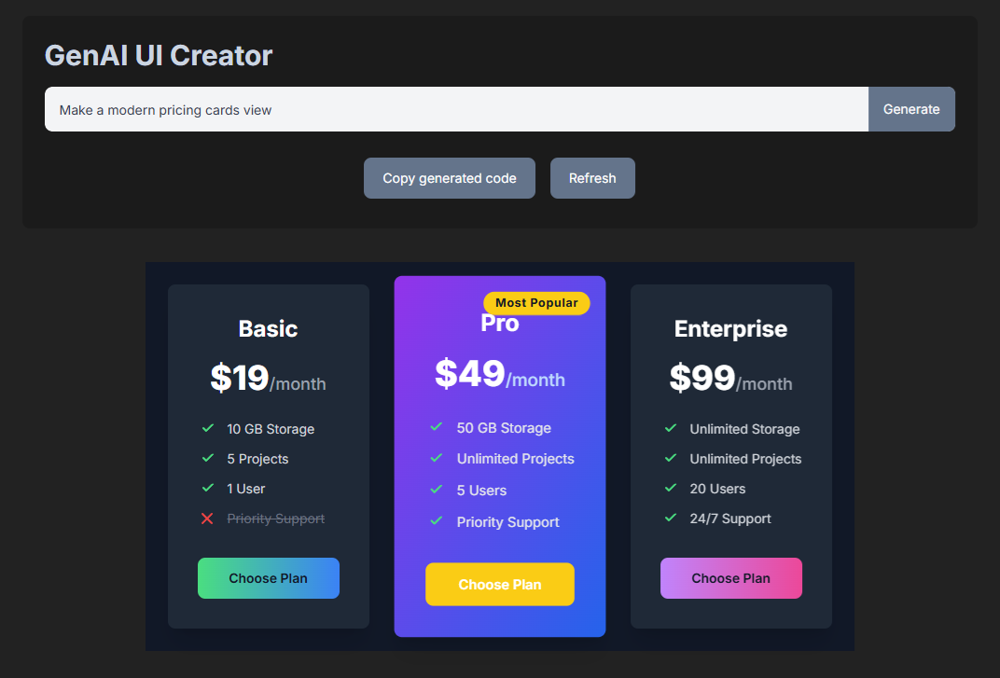

# GenAI UI Generator



<br />

# Information

- Generates a modern UI with tailwindcss, ready for use in your app by copying the generated code.

# Install and usage

1) Get the Gemini API key from [Google AI Studio](https://ai.google.dev/aistudio) and add it to a `.env` file in your root directory: `GEMINI_API_KEY='YOUR_API_KEY'`
2) Install dependencies `npm i`

3) Start development server
```bash
npm run dev
# or
yarn dev
# or
pnpm dev
```

# Technologies
- Next.js
- tailwindcss
- Gemini AI (gemini-2.5-flash-lite model)
